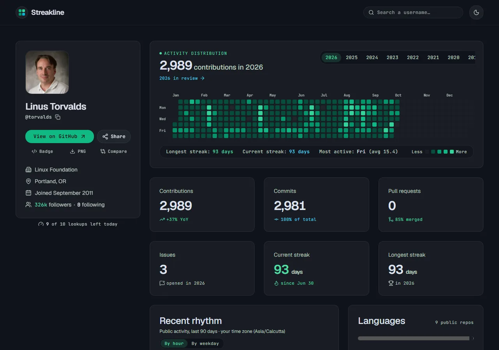
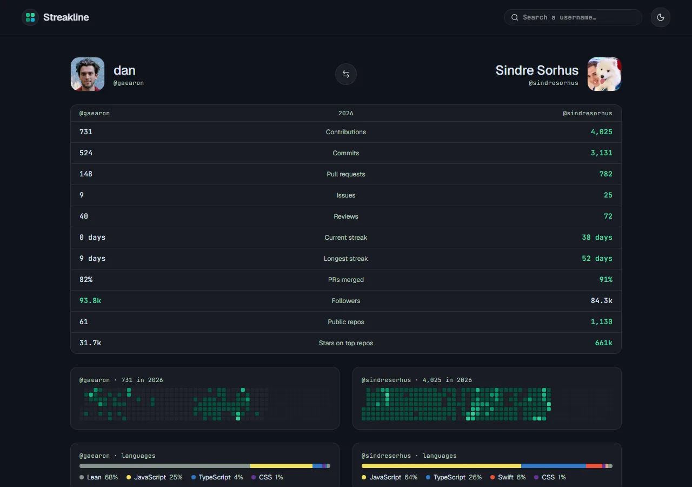
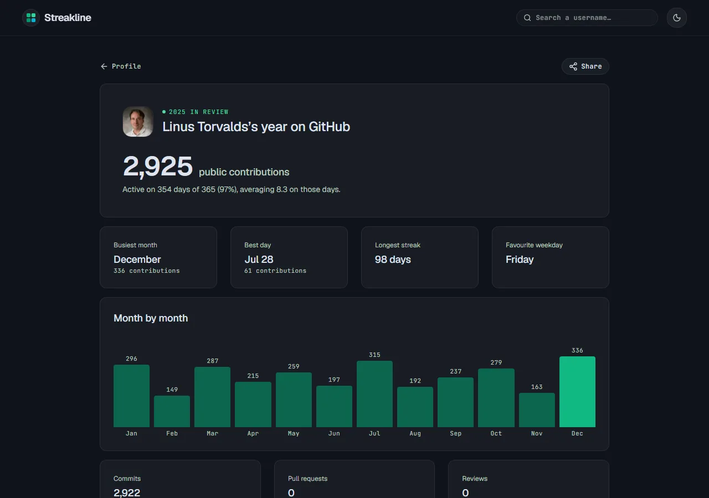
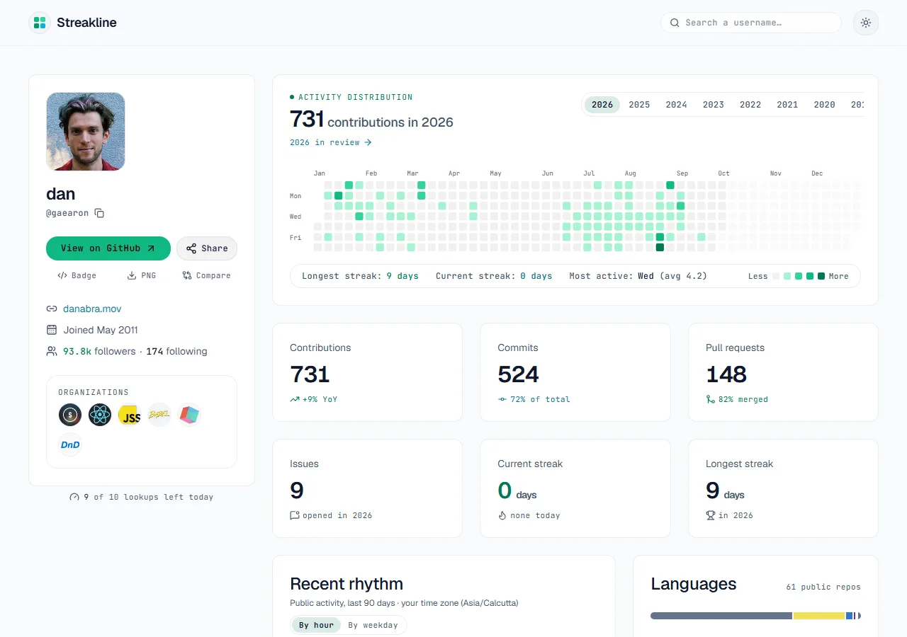
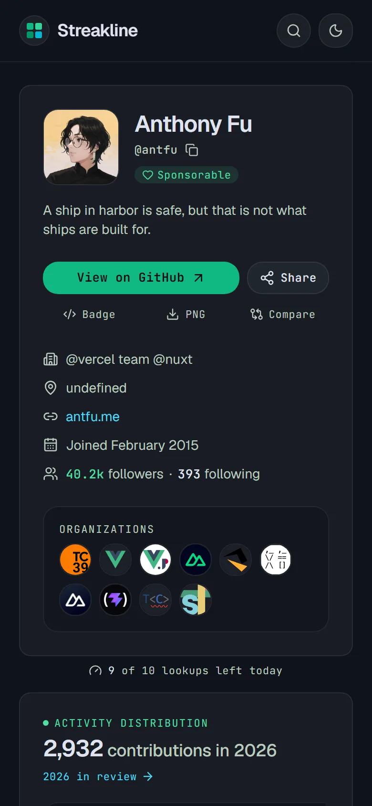

# Streakline

An elegant view of anyone's **public** GitHub activity. Enter a username and get
their contribution heatmap, streaks, rhythm, languages, top repositories and the
projects they contribute to — on one calm, readable page.

Live: https://ritesh-dhekane.github.io/streakline/

[](https://ritesh-dhekane.github.io/streakline/Ritesh-Dhekane)

## Screenshots



| Compare two people                                                      | Year in review                                                      |
| ----------------------------------------------------------------------- | ------------------------------------------------------------------- |
|  |  |

| Light theme                                                                | On a phone                                                                            |
| -------------------------------------------------------------------------- | ------------------------------------------------------------------------------------- |
|  |  |

## Features

- Profile page: heatmap by year, streaks, stats, hourly/weekday rhythm, languages, top repos
  and the open-source projects someone contributes to.
- **README badge**: a live card for your GitHub profile README (button "Badge" on any profile):
  `` — add `?theme=light`
  for the light version.
- **Share links** with rich previews on LinkedIn, X, WhatsApp and Slack
  (`https://streakline-api.streakline.workers.dev/u/<user>`), and a **PNG download** of the card.
- **Compare** two people: `/streakline/<user>/vs/<other>`.
- **Year in review**: `/streakline/<user>/review/<year>`.
- Recently viewed profiles on the home page (kept in your browser only).
- Each visitor can look up 10 different people a day; the examples don't count.

## How it works

```
GitHub Pages (this site)  ──▶  Cloudflare Worker (/api)  ──▶  GitHub API
static React app               holds the GitHub token,         public data only
                               caches each profile
```

- The site is static and hosted on GitHub Pages.
- A small Cloudflare Worker fetches data from GitHub. It holds the GitHub token as a
  Cloudflare secret, so the token never reaches the browser and is never in this repo.
- The token only has read access to public repositories, so private data can't be
  fetched even by mistake. Streakline only ever shows public activity.

## Development

Requirements: Node.js 20+ and **npm 11** (`npm install -g npm@11` — npm 10.9 fails to
resolve this project's dependencies).

```
npm install
cp .env.example .env
npm run dev          # site on http://localhost:5173/streakline/
```

| Command                 | Does                             |
| ----------------------- | -------------------------------- |
| `npm run dev`           | Start the site locally           |
| `npm run build`         | Type-check and build to `dist/`  |
| `npm test`              | Run the tests                    |
| `npm run lint`          | Lint (oxlint)                    |
| `npm run typecheck`     | TypeScript only                  |
| `npm run format`        | Format with Prettier             |
| `npm run worker:dev`    | Run the API locally on port 8787 |
| `npm run worker:deploy` | Deploy the API to Cloudflare     |

### Running the API locally

1. Put GitHub credentials (see below) in `.dev.vars` (git-ignored):
   `cp .dev.vars.example .dev.vars`, then replace the placeholder.
2. `npm run worker:dev` — the API runs on http://localhost:8787, e.g.
   http://localhost:8787/api/user/octocat
3. In another terminal, `npm run dev` for the site (`.env` already points at port 8787).

## Deploying the API (Cloudflare Worker)

The Worker talks to GitHub as a **GitHub App** (or, as a fallback, with a personal token) and
keeps the credentials as encrypted Cloudflare secrets — never in this repository or the site.

### 1. Create the GitHub App (public data only)

1. GitHub → **Settings → Developer settings → GitHub Apps → New GitHub App**.
2. Homepage URL: the site's URL. Untick **Webhook → Active**. Leave every permission at
   "No access". Install only on your own account.
3. Note the **App ID**, click **Generate a private key** (downloads a `.pem`), then
   **Install App** on your account; the installation ID is the number at the end of the URL.

With no permissions, the App can only read public data.

### 2. Deploy the Worker

```sh
npx wrangler login                                   # once; opens the browser
npx wrangler d1 create streakline                    # put the printed database_id in wrangler.toml
npx wrangler d1 migrations apply streakline --remote
npm run worker:deploy                                # prints the Worker URL
npx wrangler secret put GITHUB_APP_ID
npx wrangler secret put GITHUB_APP_INSTALLATION_ID
npx wrangler secret put GITHUB_APP_PRIVATE_KEY < path/to/app.private-key.pem
npx wrangler secret put VISITOR_SALT                 # any long random string
```

Check it: open `<worker URL>/api/user/octocat`.

Instead of the App you can set `GITHUB_TOKEN` to a fine-grained personal token with
**Public repositories (read-only)** access.

Each visitor (a salted hash of their IP, kept for a day in D1) can look up 10 different users
a day; the owner's profile and the landing page examples don't count (`shared/limits.ts`).
Allowed browser origins are in `wrangler.toml` (`ALLOWED_ORIGINS`).

### 3. Publish the site

Every push to `main` runs checks and deploys to GitHub Pages
(`.github/workflows/deploy.yml`). The site reads the Worker URL from `.env.production`.
One-time setup: repository **Settings → Pages → Source: GitHub Actions**.

Optional analytics: Cloudflare Web Analytics (cookieless). Add the site in the Cloudflare
dashboard → Web Analytics, and put its token in `.env.production` as `VITE_CF_BEACON_TOKEN`.

## Project layout

```
src/       the website (React + TypeScript + Tailwind)
shared/    types and calculations shared by the site and the Worker
worker/    the Cloudflare Worker API
```

## License

[MIT](LICENSE) © 2026 Ritesh Dhekane
